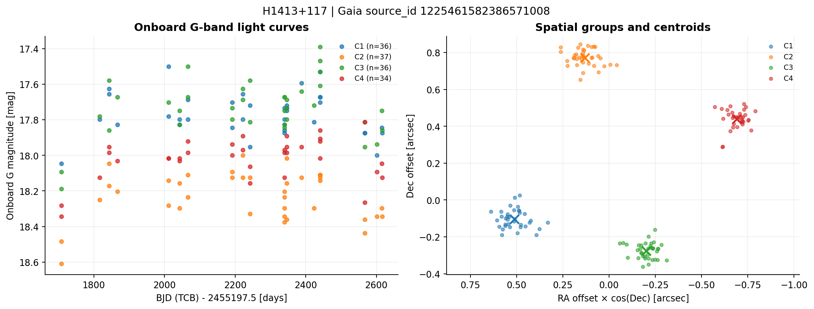

# Gaia y K-means: componentes espaciales y curvas de luz de lentes gravitacionales

Este proyecto analiza observaciones reales de Gaia asociadas a un catálogo de **340 sistemas de lentes gravitacionales**. Utiliza K-means para agrupar detecciones por su posición, reconstruir curvas de luz y comparar magnitudes de componentes observados en épocas cercanas. Combina análisis de datos, geometría de coordenadas, aprendizaje no supervisado y control de calidad en un flujo reproducible de Python.

El desarrollo parte de un catálogo de **340 sistemas**, conservado como referencia, y de un notebook facilitado por el **Dr. Timo Anguita**, director del Doctorado en Astrofísica de la Universidad Andrés Bello, sede Santiago. La adaptación, documentación y organización de este repositorio corresponden a **Matías Almonacid Mellado**. El notebook base se conserva sin modificaciones en `reference/`.

## Resultados del análisis

| Medida | Resultado |
| --- | ---: |
| Objetivos del catálogo | 340 |
| Observaciones descargadas | 34.654 |
| Observaciones dentro del radio de 3 arcsec | 31.221 |
| Objetivos con observaciones seleccionadas | 289 |
| Combinaciones lente–fuente Gaia procesadas | 379 |
| Grupos espaciales, sumados por lente–fuente | 864 |
| Pares temporales entre componentes | 18.886 |

El recuento de grupos suma los ajustes realizados para cada fuente Gaia y no se interpreta como un número de imágenes físicas independientes. Los pares tampoco equivalen a épocas independientes. Los diagnósticos registran la estabilidad de cada ajuste; con esta configuración, las particiones coinciden entre las diez semillas comprobadas.

## Ejemplo: H1413+117

Dentro del conjunto analizado hay **143 observaciones** de H1413+117 para la fuente Gaia `1225461582386571008`. El agrupamiento produce **cuatro componentes**, una silueta de **0.8769** y un ARI de **1.0000** entre las diez semillas de comprobación. Se obtienen **207 pares temporales** entre las seis parejas posibles de componentes; una observación puede intervenir en comparaciones con componentes distintos.



El ARI evalúa estabilidad ante inicializaciones. La silueta resume separación espacial. Ninguna de estas métricas valida por sí sola la identificación física de las imágenes.

## El problema

En un sistema de lente gravitacional, varias imágenes de un cuásar pueden aparecer muy próximas en el cielo. Para estudiar su variabilidad se necesita saber a qué componente pertenece cada observación y comparar mediciones tomadas en épocas compatibles.

La pregunta de este proyecto es: **¿cómo organizar las posiciones y magnitudes de Gaia en grupos espaciales reproducibles y construir comparaciones temporales trazables?**

La salida es una preparación de datos para estudios posteriores de microlensing. Una diferencia de magnitudes entre componentes requiere interpretación física: intervienen la variabilidad intrínseca del cuásar, los retardos temporales de la lente, la magnificación y los efectos instrumentales [5, 6].

## Datos

- **Objetivos:** `data/raw/lenses.csv`, catálogo facilitado junto al notebook base, con coordenadas y propiedades de los sistemas.
- **Observaciones:** tabla `gaiafpr.lens_observation` del Gaia Focused Product Release [1, 2].
- **Fuentes seleccionadas:** 390 fuentes FPR con al menos un centro de componente dentro de 10 segundos de arco de una posición del catálogo. Se descargan sus observaciones y después se aplica el filtro individual de 3 segundos de arco.
- **Selección documentada:** `references/source_preselection.adql`, `data/raw/selected_source_ids.csv` y las consultas por fuente en `references/download_query.adql`.
- **Selección angular:** se conservan las observaciones dentro de un radio de 3 segundos de arco del objetivo más cercano del catálogo.
- **Procedencia:** consulta ADQL, fecha de descarga y sumas SHA-256 en `references/download_query.adql` y `data/raw/download_metadata.json`.

Los identificadores Gaia se leen como texto para conservar todos sus dígitos. `component_id` identifica un componente **dentro de cada `source_id`**; `observation_id` es un contador por componente y no un identificador común de tránsito [2].

La fotometría utilizada es `g_mag_obs`, una estimación de magnitud G realizada a bordo. La escala temporal es **BJD en TCB − 2455197.5, en días** [2]. Las figuras indican estas unidades.

El origen y la versión de la exportación del catálogo de objetivos no están confirmados por metadatos del CSV. La información de procedencia, atribución y condiciones de los datos está en [DATA_SOURCES.md](DATA_SOURCES.md).

## Método

1. **Revisión de datos.** Se comprueban identificadores, filas repetidas, coordenadas, épocas y cobertura del catálogo. Se conserva la copia original de los datos.
2. **Asociación espacial.** Se busca el objetivo más cercano mediante distancia angular sobre la esfera. Las asociaciones con más de un objetivo dentro del radio quedan marcadas.
3. **Coordenadas relativas.** Se expresan las posiciones en segundos de arco mediante ΔRA × cos(Dec) y ΔDec, ajustando el cruce de RA por 0/360 grados. Ambos ejes mantienen la misma unidad angular.
4. **K-means por lente y fuente Gaia.** Se usa `k-means++`, 20 inicializaciones y una semilla fija [3]. El número de grupos se obtiene de los componentes Gaia presentes en esa fuente; es una decisión de procesamiento, no una estimación independiente del número de imágenes de la lente.
5. **Identificación reproducible.** Los centros se ordenan desde mayor a menor RA: C1 es el grupo más oriental. Se guardan los identificadores originales y una tabla de correspondencia. C1, C2, etc. no se equiparan a las imágenes A, B, C de una publicación.
6. **Control del agrupamiento.** Se registra la silueta [4], la inercia y la concordancia ARI entre diez semillas. La muestra de silueta conserva al menos una posición de cada grupo. Un ajuste fallido queda registrado y no se sustituye silenciosamente por otro resultado.
7. **Comparación temporal.** Se buscan vecinos temporales mutuos, uno a uno, con una tolerancia de 1 segundo. Se guardan ambas épocas y su diferencia. Se compara también el número de pares obtenido con tolerancias de 0.1 y 10 segundos.
8. **Exploración.** Se generan curvas de luz, mapas de posiciones y diferencias brutas de magnitud entre componentes emparejados. No se interpolan observaciones ni se corrigen los retardos temporales de la lente.

La publicación de Gaia describe un procesamiento basado en **DBSCAN** [1]. El K-means de este proyecto es una etapa exploratoria posterior y no reproduce el procesamiento oficial de Gaia.

## Ejecutar el proyecto

Se incluye una copia de las observaciones y de los resultados, por lo que la reproducción no requiere consultar Gaia de nuevo. Entorno comprobado: Python 3.12.

Desde la carpeta del repositorio:

```bash
python -m pip install -r requirements.txt
python run_analysis.py
```

Para seguir el análisis explicado, abrir `notebooks/gaia_lens_components.ipynb` en Jupyter y ejecutar las celdas en orden. El notebook utiliza los mismos módulos que el script.

```bash
jupyter lab
```

Los parámetros están en `config.json`. Las tablas se escriben en `results/` y `data/processed/`; las figuras, en `figures/`.

La descarga es opcional:

```bash
python download_gaia.py
```

Este comando consulta las fuentes de `data/raw/selected_source_ids.csv`, indicado mediante `source_ids_file` en `config.json`. La copia local se actualiza después de completar y validar las respuestas. La disponibilidad y el tiempo de respuesta dependen del servicio.

Para ampliar el estudio se deben actualizar y documentar tanto el catálogo como la selección de fuentes. El flujo no descarga toda la información de Gaia: trabaja con el producto FPR, la preselección indicada y el radio angular elegido.

## Archivos del repositorio

| Archivo o carpeta | Contenido |
| --- | --- |
| `notebooks/gaia_lens_components.ipynb` | Análisis explicado con texto, código y salidas |
| `src/lens_analysis.py` | Asociación, K-means, validación, pares temporales y figuras |
| `run_analysis.py` | Ejecución completa con la copia local |
| `download_gaia.py` | Consulta opcional al archivo Gaia |
| `data/raw/` | Catálogo, observaciones originales y metadatos |
| `data/processed/` | Observaciones con grupos espaciales y pares temporales |
| `results/` | Cobertura, diagnósticos, centros y estabilidad |
| `figures/` | Figuras de sistemas seleccionados |
| `reference/` | Notebook base facilitado por el Dr. Timo Anguita |
| `references/references.bib` | Bibliografía en BibTeX |
| `tests/` | Comprobaciones de coordenadas, etiquetas e identificación temporal |
| `CHANGELOG.md` | Cambios de esta adaptación respecto del notebook base |
| `VALIDATION.md` | Entorno, verificaciones y resultados comprobados |

## Alcance de las conclusiones

Los grupos describen proximidad espacial en las observaciones seleccionadas. Su correspondencia con imágenes del cuásar requiere contraste con imágenes de mayor resolución y bibliografía de cada sistema; también pueden existir fuentes contaminantes o emisión de la galaxia lente.

Una silueta alta o un ARI próximo a uno permiten evaluar propiedades del agrupamiento, pero no demuestran que la identificación física sea correcta. El número de grupos y el radio de búsqueda condicionan los resultados. Un objetivo sin datos dentro de este radio no implica ausencia de observaciones en otros productos de Gaia.

Las magnitudes a bordo no se tratan como fotometría calibrada de precisión. Las diferencias `delta_g` son descriptivas y no constituyen una detección de microlensing. Para un análisis físico harían falta revisar calibración e incertidumbres, identificar las imágenes, corregir los retardos temporales y aplicar un modelo adecuado [5, 6].

## Referencias

1. Gaia Collaboration, Krone-Martins, A. et al. (2024). *Gaia Focused Product Release: A catalogue of sources around quasars to search for strongly lensed quasars*. **A&A, 685, A130**. [DOI](https://doi.org/10.1051/0004-6361/202347273). Datos: ESA et al. (2023), versión 1.0, [DOI 10.57780/esa-sfvnhs3](https://doi.org/10.57780/esa-sfvnhs3).
2. European Space Agency. *Gaia FPR documentation: lens_observation*. [Modelo de datos](https://gea.esac.esa.int/archive/documentation/FPR/chap_datamodel/sec_dm_focused_product_release/ssec_dm_lens_observation.html). Consulta: 1 de octubre de 2026.
3. Arthur, D. & Vassilvitskii, S. (2007). *k-means++: The Advantages of Careful Seeding*. **SODA**, 1027–1035. [Manuscrito de los autores](https://theory.stanford.edu/~sergei/papers/kMeansPP-soda.pdf).
4. Rousseeuw, P. J. (1987). *Silhouettes: A graphical aid to the interpretation and validation of cluster analysis*. **JCAM, 20**, 53–65. [DOI](https://doi.org/10.1016/0377-0427(87)90125-7).
5. Kochanek, C. S. (2004). *Quantitative Interpretation of Quasar Microlensing Light Curves*. **ApJ, 605**, 58–77. [DOI](https://doi.org/10.1086/382180).
6. Paic, E. et al. (2022). *Constraining quasar structure using high-frequency microlensing variations and continuum reverberation*. **A&A, 659, A21**. [DOI](https://doi.org/10.1051/0004-6361/202141808).

Implementación: [documentación oficial de KMeans](https://scikit-learn.org/stable/modules/generated/sklearn.cluster.KMeans.html). Las referencias completas están en `references/references.bib`.
